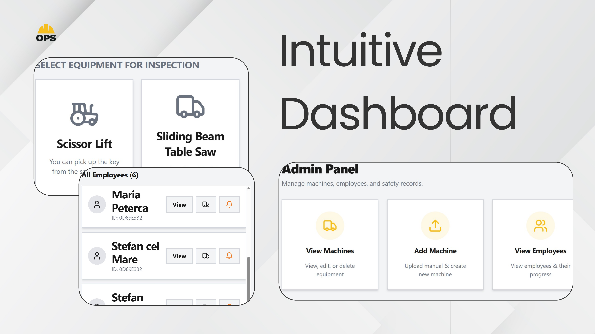

# OPS — Operational Protection Software

> Built at the Polderr Hackathon, February 2026 · 12 hours · Team of 3

OPS is a safety training web platform designed for construction machinery operators. It transforms dense, hard-to-navigate technical manuals into an interactive learning environment — accessible on-site, under time pressure, and without requiring any technical background.

The core insight behind the design: operators aren't tech-illiterate, they're time-starved. A 300-page PDF is not a usable safety tool on a loud construction site. OPS is.



---

## Features

### Worker Side
- **AI Chatbot** — trained on the specific machine's manual; operators can ask questions in plain language and get instant, relevant answers
- **Visual Guides** — AI-generated images of machine parts so operators know exactly what a component looks like before touching it
- **Text-to-Speech** — every page can be read aloud, breaking literacy and language barriers
- **Safety Warnings** — full-screen critical hazard alerts (e.g. Crushing Hazard) that must be explicitly acknowledged before proceeding
- **Randomized Quizzes** — questions drawn from a bank of 30; designed to prevent autopilot clicking and enforce genuine recall
- **QR Code Access** — every machine has a unique QR code that takes the operator directly to that machine's learning environment
- **High-Contrast UI** — large buttons and readable typography designed for gloved hands, glare, and dusty screens

### Admin Side
- **Compliance Dashboard** — see which workers are certified, which warnings have been acknowledged, and who is overdue
- **Failure Analytics** — when a worker fails a quiz, admins see exactly which questions they struggled with, not just a total score
- **Safety Refresh Intervals** — configurable recertification schedules per machine
- **Worker Notifications** — automated reminders for incomplete or expiring certifications
- **Machine Management** — upload manuals, add machines, and manage the full equipment registry

---

## Tech Stack

| Layer | Technology |
|---|---|
| Frontend | React, TypeScript, Vite |
| Styling | Tailwind CSS, shadcn/ui |
| Backend & Auth | Supabase (PostgreSQL + Auth) |
| AI | Claude API (Anthropic) |

---

## Getting Started

```bash
# Clone the repository
git clone https://github.com/petisor/site-guardian.git
cd site-guardian

# Install dependencies
npm install

# Set up environment variables
cp .env.example .env
# Add your Supabase and Anthropic API keys to .env

# Start the development server
npm run dev
```

### Environment Variables

```
VITE_SUPABASE_URL=your_supabase_url
VITE_SUPABASE_ANON_KEY=your_supabase_anon_key
VITE_ANTHROPIC_API_KEY=your_anthropic_api_key
```

---

## Background

This project was built in response to the Polderr Hackathon challenge: *rethink how technical information for construction machinery can be delivered in a way that truly supports operators in their daily work.*

The construction industry faces a compounding problem — a shrinking skilled workforce, an influx of inexperienced workers, and safety information locked in formats that aren't usable in the field. OPS addresses this directly by meeting operators where they are: on their phone, next to the machine, with limited time and attention.

---

## Team

- Maria Aimee Peterca
- Andreas Baragau  
- Stefan Mihai
